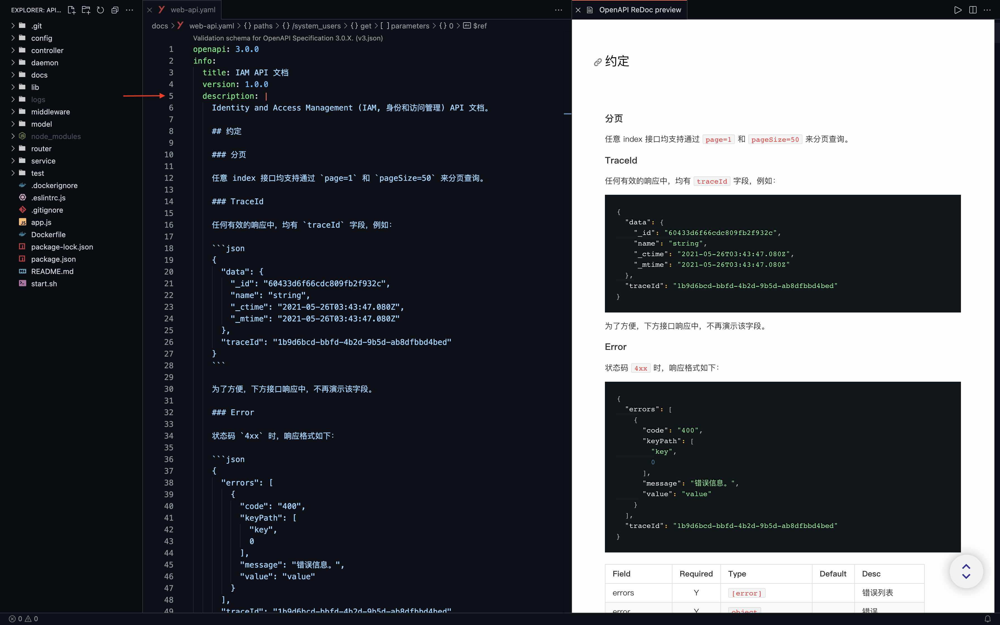
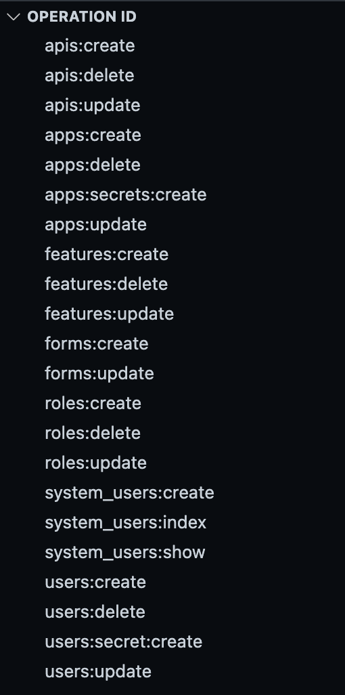
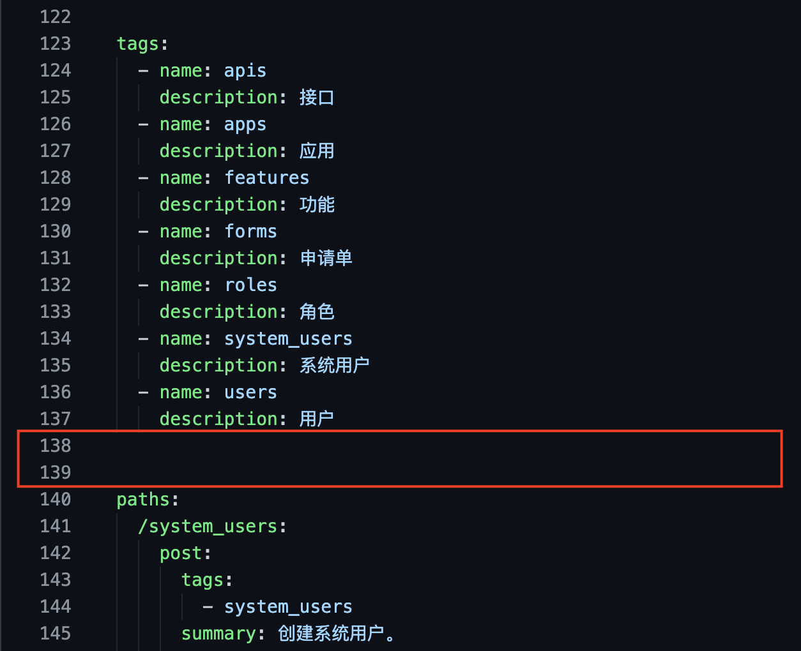

# OpenAPI \(Swagger\)

## 文件格式

推荐 `YAML`。辅助字符较少，好写好读。

## Markdown

可用来书写格式化内容或段落。比如，在 `info.description` 中书写前置信息。

## operationId 规则

 `[<parent-resource>:]<resource>:<action>`

| Field | Required | Description |
| :--- | :---: | :--- |
| parent-resource |  | 上级资源。 |
| resource | Y | 资源。 |
| action | Y | 动作，常见的值有 `create`, `index`, `show`, `update`, `delete`。 |

### 例子

* `apps:users:index` - 索引应用中的用户；
* `users:show` - 展示一个用户。

## components 复用规则

* `parameters` 可基于 `schemas`, 被 `paths` 使用；
  * path 型 `parameters` 命名格式 `:<name>`
* `requestBody` 被 `paths` 使用；
* `responses` 可基于 `schemas`, 被 `paths` 使用；
* `schemas` 可基于 `schemas`, 被其他 components 使用（注意不被 `paths` 使用）。

另外，`parameters` 和 `requestBody` 注重 `description`。

## 更多

### 合理借助空行来分隔代码，方便阅读

