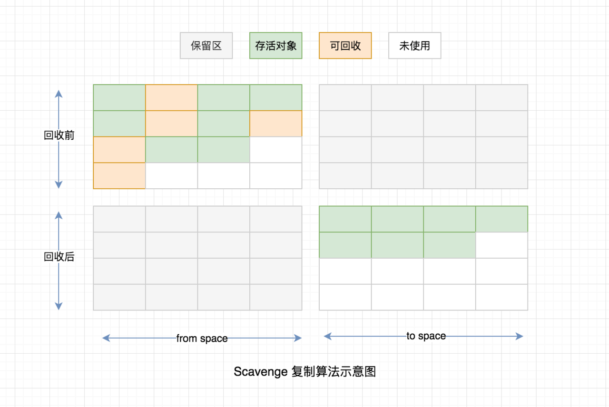

# Node.js Garbage Collection 垃圾回收

## 程序内存特点

- 频繁地新建变量，频繁地销毁变量；
- 新生的变量中多数的存活时间短，老生的变量中多数存活时间长。

## 留意

- 垃圾回收有成本：需要计算和内存，会中断事件循环；

> 在 32 位机器中，V8 限制可用内存约为 0.7GB；在 64 位机器中，V8 限制可用内存约为 1.4GB。
> 为什么？

A: 因为内存过大导致垃圾回收时间过长，对事件循环影响过于明显。

## 内存的组成

通过 `process.memoryUsage` 来查看内存。

- rss: 进程所占用的内存部分，包括代码本身、栈、堆；
- heapTotal: 堆中申请到的总内存空间；
- heapUsed: 堆中已用空间；
- external: V8 引擎内部的 C++ 对象所占的内存。

## 垃圾回收算法

### 新生代

根据该生代的内存特点，采用了 Scavenge 算法。其将内存空间分为两个等额空间 from-space 和 to-space。
将 from-space 中存活的对象复制到 to-space 中，然后释放 from-space。然后互换两个空间的角色。

### 老生代

根据该生代的内存特点，采用了 Mark-Sweep (标记-清除) 结合 Mark-Compact (标记-整理) 算法。

## 内存优化手段

- 明确无用的大内存，可通过将对象设置为 `null` 来主动释放；

## 参考

- [Node.js内存管理和V8垃圾回收机制](https://juejin.cn/post/6844903878928891911)
