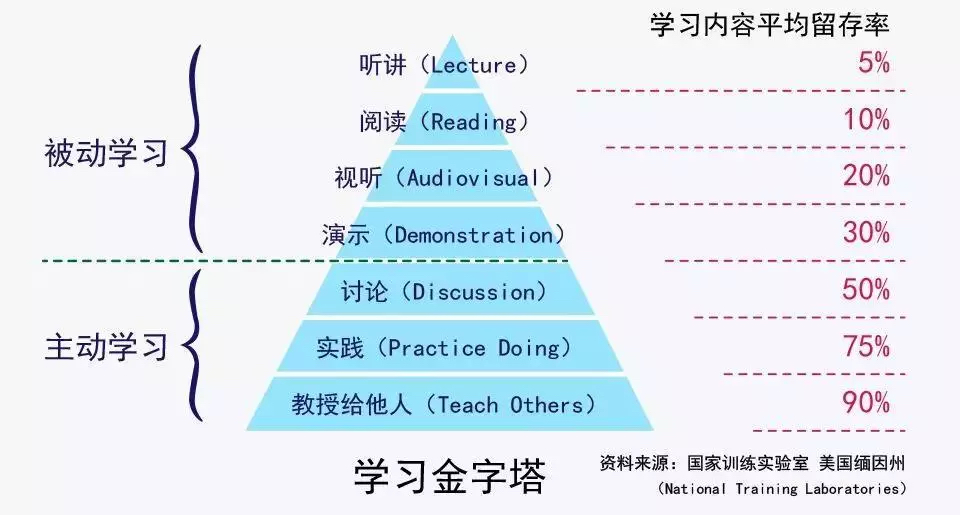
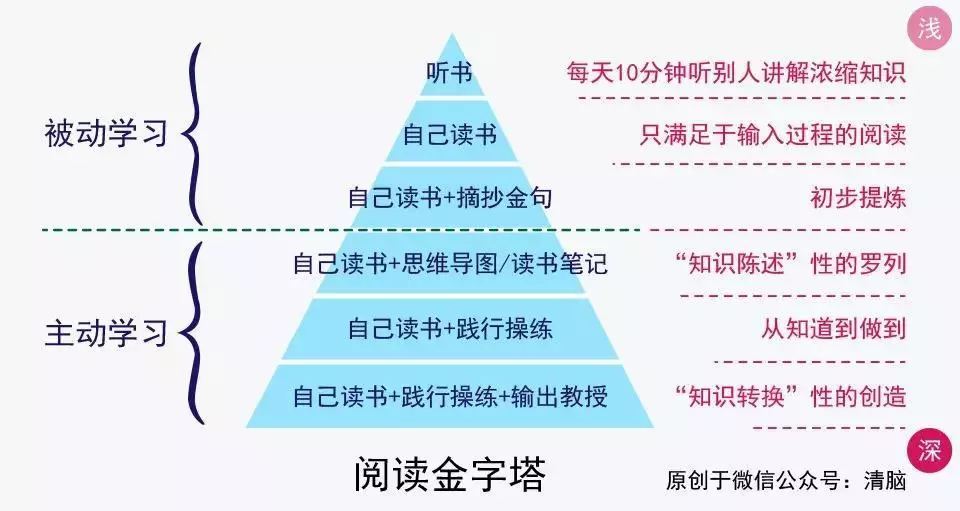

# Learning

## 每天的第一个任务

问自己：今天的目标是什么？

## 学以致用

“应用”是学习的目标，“会用”是学习成效的度量。

想要所学会用，最好的方式是即学即用。

“用”的方式很多，如

* 参与讨论
* 实践
* 教授

其核心在于人的“主动思考/创作”。“被动接受”是非常低效和易忘的。

难以实践的知识，如理论、概念等，快速浏览即可，起到“了解/知道”的效果。未来在其相关任务的实践中，会自然形成记忆/习惯。

[参考文章](https://mp.weixin.qq.com/s/TckCAw2ovU1eUVF9Z3_FOg)。

## 做事三步曲

1. 定目标（方向）
2. 定方案（思路）
3. 理性执行，动态调整

